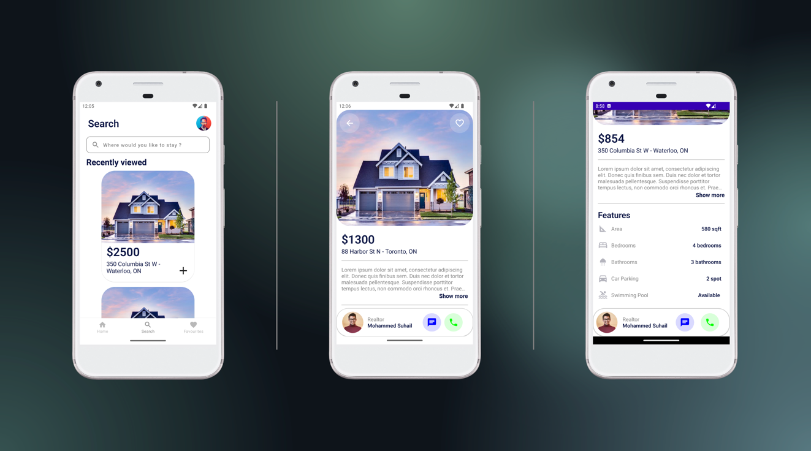

# About 

Rate my property is a platform for users to anonymously review and rate their housings (rentals, properties, etc.). This will serve as centralized information center for tenants and property buyers to seek factual recommendations/suggestions about potential rentals and help in their decision-making process.

The ability to anonymously post reviews will encourage candid and more genuine feedback. On current housing websites, the properties are posted by the owners.

The information sometimes can be incomplete and deceiving, which may mislead tenants and buyers. Our objective is to offer valuable guidance from people who have lived in a particular house or neighborhood to the ones seeking a home in the same house or similar neighborhood.The solution will be developed in a decoupled architecture. Such an approach also allows for development of various frontend applications.

## Why RateMyProperty ?

Currently existing similar websites only provide the way to connect property owners to the buyers and renters but Rate my property helps them gain insights about the property from previous users themselves. These insights are helpful in terms of providing information. The review and the rating of the property assists tenants and buyers in making decision about renting or buying a property.

## About This Repository

### Status: 🚧 In progress 🚧

RateMyProperty is still in the early stages of development, This is a Jetpack compose & MVVM take on the RateMyHousing web application

## Screenshots

## Search Flow

